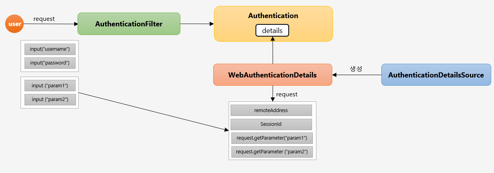

## 실전프로젝트 -인증 프로세스 Form 인증 구현

### WebIgnore 설정

- js / css /images 파일 등 보안 필터를 적용할 필요가 없는 리소스를 설정

~~~
  @Override
  public void configure(WebSecurity web) throws Exception {
    web.ignoring().requestMatchers(PathRequest.toStaticResources().atCommonLocations());
  }
~~~

### PasswordEncoder

- 비밀번호를 안전하게 암호화 하도록 제공
- Spring Security 5.0 이전에는 기본 PasswordEncoder 가 평문을 지원하는 NoOpPasswordEncoder(현재는 Deprecated)

- 생성
    - PasswordEncoder passwordEncoder = PasswordEncoderFactories.createDelegatingPasswordEncoder()

- 인터페이스
    - encode(password)
    - 패스워드 암호화
    - matches(rawPassword, encodedPassword)
    - 패스워드 비교

- 암호화 포맷 : {id}encodedPassword
    - 기본 포맷은 Bcrypt : {bcrypt}$2a$10$dXJ3SW6G7P50lGmMkkmwe.20cQQubK3.HZWzG3YB1tlRy.fqvM/BG
    - 알고리즘 종류 : bcrypt, noop, pbkdf2, scrypt, sha256

- 인터페이스
    - encode(password)
        - 패스워드 암호화
    - matches(rawPassword, encodedPassword)
        - 패스워드 비교

### 로그아웃 및 화면 보안 처리

- 로그아웃 방법
    - ```<form>``` 태그를 사용해 POST 요청
    - ```<a>``` 태그를 사용해서 GET 요청 SecurityContextLogoutHandler 활용

- 인증 여부에 따라 로그인/로그아웃 표현(Thymeleaf)
~~~  
  <li sec:authorize="isAnonymous()"><a th:href="@{/login}">로그인</a></li>
  <li sec:authorize="isAuthenticated()"><a th:href="@{/logout}">로그아웃</a></li>
~~~

- Thymeleaf 에서 SpringSecurity 표현식을 사용하는 방법

    - pom.xml 에 dependency 추가
    - html 태그에 속성 추가
~~~
        <dependency>
            <groupId>org.thymeleaf.extras</groupId>
            <artifactId>thymeleaf-extras-springsecurity5</artifactId>
        </dependency>
~~~

~~~
<html lang="ko" xmlns:th="http://www.thymeleaf.org"
      xmlns:sec="http://www.thymeleaf.org/thymeleaf-extras-springsecurity5">
~~~

### WebAuthenticationDetails, AuthenticationDetailsSource


- WebAuthenticationDetails
    - 인증 과정 중 전달된 데이터를 저장
    - Authentication의 details 속성에 저장

- AuthenticationDetailsSource
    - WebAuthenticationDetails 객체를 생성
