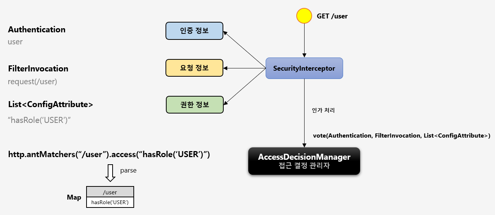

## 실전프로젝트 - 인가 프로세스 DB 연동 웹 계층 구현

### 스프링 시큐리티 인가 개요

- DB와 연동하여 자원 및 권한을 설정하고 제어함으로 동적 권한 관리가 가능하도록 한다
    - 설정 클래스 소스에서 권한 관련 코드 모두 제거
        - ex) antMatcher("/user").hasRole("USER")
- 관리자 시스템 구축
    - 회원 관리 - 권한 부여
    - 권한 관리 - 권한 생성, 삭제
    - 자원 관리 - 자원 생성, 삭제, 수정, 권한 매핑
- 권한 계층 구현
    - URL - URL 요청 시 인가 처리
    - Method - 메소드 호출 시 인가처리
        - Method
        - Pointcut

### 주요 아키텍처 이해




- 스프링 시큐리티의 인가처리
    - http.antMatchers("/user").access("hasRole('USER')")
        - 사용자가 /user 자원에 접근하기 위해서는 ROLE_USER 권한이 필요하다

### FilterInvocationSecurityMetadataSource (1)


### FilterInvocationSecurityMetadataSource (2)


- http.addFilterAt(filterSecurityInterceptor(), FilterSecurityInterceptor.class)

```
@Bean
public FilterSecurityInterceptor filterSecurityInterceptor() {
FilterSecurityInterceptor filterSecurityInterceptor = new FilterSecurityInterceptor();
filterSecurityInterceptor.setAuthenticationManager(authenticationManager);
filterSecurityInterceptor.setSecurityMetadataSource(urlFilterInvocationSecurityMetadataSource());
filterSecurityInterceptor.setAccessDecisionManager(accessDecisionManager);
return filterSecurityInterceptor;
}
```

```
@Bean
public FilterInvocationSecurityMetadataSource urlFilterInvocationSecurityMetadataSource() {
return new UrlFilterInvocationSecurityMetadataSource();
}
```

### 웹 기반 인가처리 실시간 반영하기


### PermitAllFilter 구현

- 인증 및 권한심사를 할 필요가 없는 자원(/, /home, /login..)들을 미리 설정해서 바로 리소스 접근이 가능하게 하는 필터


### RoleHierarchy

- RoleHierarchy
  - 상위 계층 Role 은 하위 계층 Role 의 자원에 접근 가능함
  - ROLE_ADMIN -> ROLE_MANAGER -> ROLE_USER 일 경우 ROLE_ADMIN 만 있으면 하위 ROLE 의 권한을 모두 포함한다
- RoleHierarchyVoter
  - RoleHierarchy 를 생성자로 받으며 이 클래스에서 설정한 규칙이 적용되어 심사함

### CustomIpAddressVoter

- 심의 기준
  - 특정한 IP 만 접근이 가능하도록 심의하는 Voter 추가
  - Voter 중에서 가장 먼저 심사하도록 하여 허용된 IP 일 경우에만 최종 승인 및 거부 결정을 하도록 한다
  - 허용된 IP 이면 ACCESS_GRANTED 가 아닌 ACCESS_ABSTAIN 을 리턴해서 추가 심의를 계속 진행하도록 한다
  - 허용된 IP 가 아니면 ACCESS_DENIED 를 리턴하지 않고 즉시 예외 발생하여 최종 자원 접근 거부


